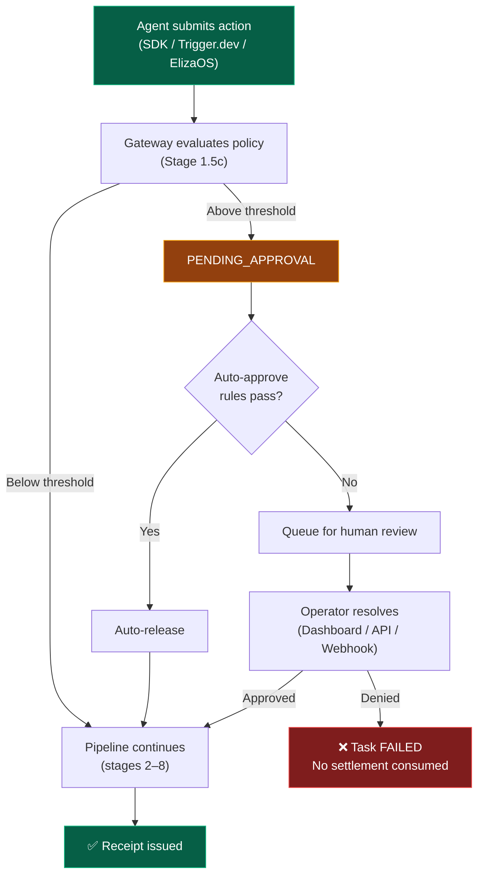

The Approval Queue is AgentChain's **programmable governance primitive**. When an agent action exceeds a risk threshold, the pipeline holds the action in `PENDING_APPROVAL` state until an operator explicitly approves or denies it.

No value moves until a human says so.

---

## How It Works



<Info>
**The approval is a gate, not a stamp.** The task pipeline (compute, IPFS, fingerprint, settlement) does _not_ execute until approved. No settlement is consumed until the action is released.
</Info>

---

## Configuring Thresholds

Set up approval thresholds in your operator guardrails:

```bash
curl -X PATCH https://api.agentchain.xyz/api/v1/operator/guardrails \
  -H "Authorization: Bearer $JWT" \
  -H "Content-Type: application/json" \
  -d '{
    "approvalThreshold": 5000,
    "approvalTtlHours": 24
  }'
```

| Setting | Type | Default | Description |
|---|---|---|---|
| `approvalThreshold` | number | `null` (disabled) | Actions with `requestedValue` above this amount require approval |
| `approvalTtlHours` | number | `24` | Hours before an unresolved approval auto-expires as denied |
| `approvalWebhookUrl` | string | `null` | URL to receive webhook notifications on approval events |
| `approvalWebhookSecret` | string | auto-derived | HMAC secret for webhook verification. If omitted, derived from your operator ID. |
| `approvalAutoRules` | array | `[]` | Auto-approve rules (see below) |

---

## Resolving Approvals

### Via Dashboard

Navigate to **Approvals** in the sidebar. Click into a pending request to see:
- Action details (agent, type, amount, target)
- Why it was held (threshold trigger reason)
- Evidence artifacts from the SDK
- **Approve** or **Deny** buttons with optional notes

### Via API

Resolve approvals programmatically using your API key — no browser required:

```bash
curl -X PATCH https://api.agentchain.xyz/api/v1/approvals/$APPROVAL_ID \
  -H "x-api-key: $API_KEY" \
  -H "Content-Type: application/json" \
  -d '{"decision": "approved", "note": "Verified with finance team"}'
```

### Via SDK

```typescript
const ac = new AgentChain({
  apiKey: process.env.AGENTCHAIN_API_KEY,
  agentId: 'agent_ops-bot_a1b2c3',
});

// List pending approvals
const pending = await ac.listApprovals();

// Approve the first one
await ac.resolveApproval(pending[0].id, 'approved', 'Looks good');
```

---

## Auto-Approve Rules

Configure rules that automatically resolve approvals without human intervention. Rules compose with **AND logic** — all rules must pass for auto-approval.

```json
{
  "approvalAutoRules": [
    { "type": "amount_cap", "maxValue": 1000 },
    { "type": "allowlisted_target", "targets": ["0xAcme", "0xVendor"] },
    { "type": "time_window", "days": ["mon","tue","wed","thu","fri"], "startHour": 9, "endHour": 17, "tz": "US/Eastern" },
    { "type": "trusted_agent", "minTrustLevel": "STANDARD" }
  ]
}
```

| Rule Type | Description |
|---|---|
| `amount_cap` | Auto-approve if `requestedValue ≤ maxValue` |
| `allowlisted_target` | Auto-approve if target is on the allowlist |
| `time_window` | Auto-approve only during specified business hours |
| `trusted_agent` | Auto-approve for agents at or above a trust level |

<Tip>
**Start conservative.** Set `amount_cap` to a low value and expand as you build confidence. Auto-approve rules reduce friction without sacrificing governance.
</Tip>

---

## Webhooks

When configured, AgentChain delivers **dual-signed** webhooks on approval lifecycle events. Every payload ships with two independent verification headers — pick the one that fits your stack.

| Event | When |
|---|---|
| `approval.required` | New approval created (action held) |
| `approval.resolved` | Operator approved or denied |
| `approval.expiring` | 1 hour before TTL expiry |

<Info>
**Using the SDK or middleware?** You don't need to verify webhooks manually. The `@agentchain/trigger-verify` middleware and `@agentchain/eliza-plugin` handle all signature verification internally. This section is for operators consuming raw webhooks.
</Info>

### Webhook Headers

Every webhook includes **both** verification signatures:

| Header | Path | Description |
|---|---|---|
| `x-agentchain-signature` | Web2 | HMAC-SHA256 — verify with 3 lines, zero dependencies |
| `x-agentchain-eip712-sig` | Web3 | EIP-712 typed data — on-chain verifiable, identity-bound |
| `x-agentchain-signer` | Web3 | Gateway address (for EIP-712 recovery) |
| `Content-Type` | — | `application/json` |

### Webhook Payload

```json
{
  "event": "approval.resolved",
  "approvalId": "clx9abc123",
  "taskId": "task_abc123",
  "agentId": "agent_invoice-bot_a1b2c3",
  "actionType": "spend_control",
  "operation": "invoice_payment",
  "target": "0xAcme",
  "requestedValue": 12000,
  "currency": "USDC",
  "triggerPolicy": "human_approval_threshold",
  "triggerReason": "$12,000 exceeds auto-approve limit of $5,000",
  "resolveUrl": "https://dashboard.agentchain.xyz/approve/clx9abc123",
  "decision": "approved",
  "decidedBy": "operator_xyz",
  "timestamp": "2026-04-12T02:30:00.000Z"
}
```

### Verifying Webhooks

<CodeGroup>
```typescript HMAC (Recommended)
import { createHmac } from 'crypto';

function verifyWebhook(body: string, signature: string, secret: string): boolean {
  const expected = `sha256=${createHmac('sha256', secret).update(body).digest('hex')}`;
  return signature === expected;
}

// In your webhook handler:
const isValid = verifyWebhook(
  rawBody,
  req.headers['x-agentchain-signature'],
  process.env.AGENTCHAIN_WEBHOOK_SECRET,
);
```

```typescript EIP-712 (Crypto-Native)
import { verifyTypedData } from 'viem';

const domain = { name: 'AgentChain', version: '1', chainId: 84532 };

const types = {
  ApprovalWebhook: [
    { name: 'event', type: 'string' },
    { name: 'approvalId', type: 'string' },
    { name: 'taskId', type: 'string' },
    { name: 'agentId', type: 'string' },
    { name: 'actionType', type: 'string' },
    { name: 'operation', type: 'string' },
    { name: 'target', type: 'string' },
    { name: 'requestedValue', type: 'string' },
    { name: 'currency', type: 'string' },
    { name: 'triggerPolicy', type: 'string' },
    { name: 'triggerReason', type: 'string' },
    { name: 'resolveUrl', type: 'string' },
    { name: 'decision', type: 'string' },
    { name: 'decidedBy', type: 'string' },
    { name: 'timestamp', type: 'string' },
  ],
};

async function verifyWebhook(req: Request): Promise<boolean> {
  const payload = await req.json();
  const signature = req.headers.get('x-agentchain-eip712-sig');
  const signer = req.headers.get('x-agentchain-signer');
  if (!signature || !signer) return false;

  const message = {
    ...payload,
    requestedValue: String(payload.requestedValue ?? '0'),
    currency: payload.currency ?? '',
    decision: payload.decision ?? '',
    decidedBy: payload.decidedBy ?? '',
  };

  return verifyTypedData({
    address: signer as `0x${string}`,
    domain,
    types,
    primaryType: 'ApprovalWebhook',
    message,
    signature: signature as `0x${string}`,
  });
}
```
</CodeGroup>

### When to use which

| You are... | Use | Why |
|---|---|---|
| Trigger.dev developer | HMAC | 3 lines, Node.js stdlib, no crypto dependencies |
| ElizaOS plugin author | Neither | The SDK handles it for you |
| Building a custom dashboard | HMAC | Simple, fast, well-understood |
| Building on-chain dispute evidence | EIP-712 | Signature is verifiable by a smart contract |
| Paranoid (good) | Both | Verify HMAC first (fast), then EIP-712 (identity) |

<Tip>
**Configuration tip:** You can set a custom `approvalWebhookSecret` in your guardrails config. If you don't, AgentChain derives a deterministic secret from your operator ID — webhook verification works out of the box.
</Tip>

---

## One-Shot Callbacks

Register a callback URL for a specific approval. When resolved, AgentChain POSTs the result to your URL once and deletes the registration.

```bash
curl -X POST https://api.agentchain.xyz/api/v1/approvals/$APPROVAL_ID/callback \
  -H "x-api-key: $API_KEY" \
  -H "Content-Type: application/json" \
  -d '{"callbackUrl": "https://your-app.com/webhooks/approval-resolved"}'
```

<Info>
**Trigger.dev integration:** The `@agentchain/trigger-verify` middleware uses one-shot callbacks with `wait.forToken()` to checkpoint Trigger tasks at zero compute cost during approval. See the [SDK Reference](/agentchain/sdk) for details.
</Info>

---

## Framework Integration

### Trigger.dev

```typescript
import { agentchainMiddleware, invoiceSafe } from '@agentchain/trigger-verify';
import { task, tasks } from '@trigger.dev/sdk';

// Register middleware with zero-cost approval wait
tasks.middleware('agentchain', agentchainMiddleware({
  apiKey: process.env.AGENTCHAIN_API_KEY!,
  agentId: process.env.AGENTCHAIN_AGENT_ID!,
  approvalMode: 'wait-token',  // Task checkpoints, resumes on approval
}));

// Define a policy-gated task
export const payInvoice = task({
  id: 'pay-invoice',
  ...invoiceSafe({
    vendor: (p) => p.vendorWallet,
    amount: (p) => p.amount,
  }),
  run: async (payload) => {
    // Only runs after policy check + approval (if needed)
    await transferUSDC(payload.vendorWallet, payload.amount);
  },
});
```

### ElizaOS

```typescript
import { approvalGated } from '@agentchain/eliza-plugin';
import { sendUSDC } from './actions/send-usdc';

export const safeSendUSDC = approvalGated(sendUSDC, {
  actionType: 'spend_control',
  operation: 'transfer_usdc',
  target: (runtime, msg) => extractWallet(msg.content.text),
  requestedValue: (runtime, msg) => extractAmount(msg.content.text),
});
```

---

## API Reference

| Endpoint | Method | Auth | Description |
|---|---|---|---|
| `/api/v1/approvals` | GET | JWT / API Key | [List pending approvals](/api-reference/approvals/list-approval-requests) |
| `/api/v1/approvals/count` | GET | JWT / API Key | [Get pending count](/api-reference/approvals/get-pending-approval-count) |
| `/api/v1/approvals/:id` | GET | JWT / API Key | [Get approval detail](/api-reference/approvals/get-approval-request-detail) |
| `/api/v1/approvals/:id` | PATCH | JWT / API Key | [Resolve approval](/api-reference/approvals/resolve-an-approval-request) |
| `/api/v1/approvals/:id/callback` | POST | JWT / API Key | [Register webhook callback](/api-reference/approvals/register-approval-webhook-callback) |

<Warning>
**Security:** An agent cannot approve its own actions. The API key used for resolution must belong to the operator, not the agent that submitted the action. Ownership is enforced server-side.
</Warning>
