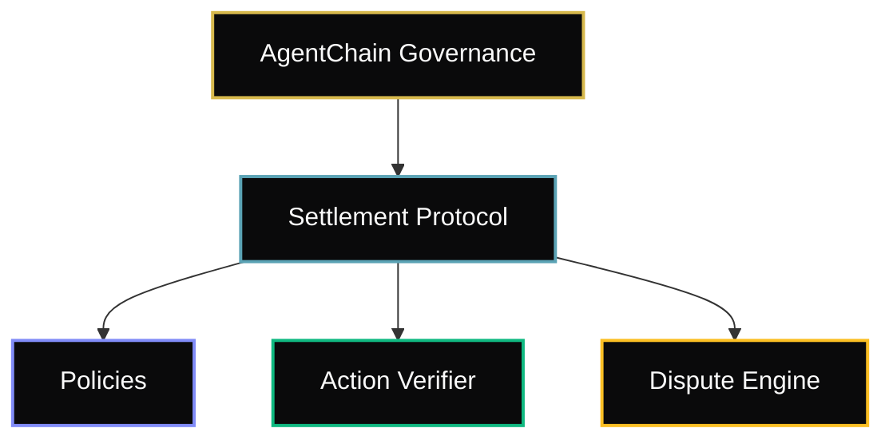
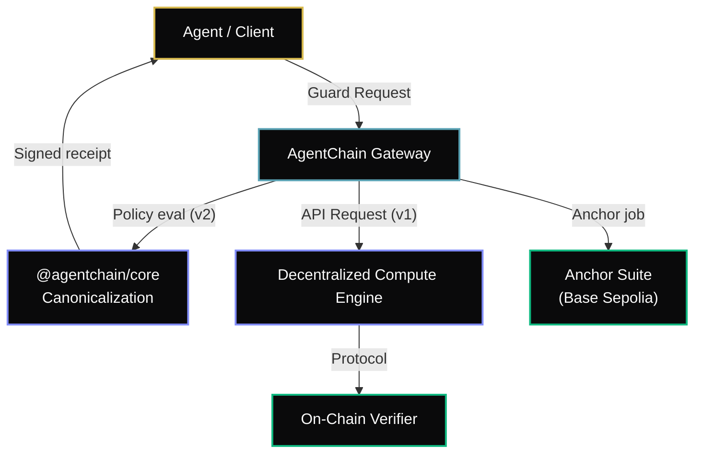

AgentChain is a verification and settlement protocol for autonomous agent actions. It answers one question: **did the agent do what it claimed?**

---

## The Trust Pipeline

Every agent action moves through five stages:

| Stage | What Happens | Where |
|---|---|---|
| **Policy** | Agent owner registers allowed targets, selectors, and constraints | `AgentPolicy.sol` (Base Sepolia) |
| **Execution** | Agent performs the action (API call, token swap, state mutation) | Decentralized Worker Pool |
| **Verification** | Protocol replays the state transition or scores the output | `ActionVerifier.sol` |
| **Attestation** | Permanent EAS attestation minted with verification result | EAS Predeploy |
| **Settlement** | Result anchored on-chain with task ID mapping | `TaskMarket.sol` (Base Sepolia) |

---

## Contract Architecture

AgentChain uses a structured hierarchy of upgradeable proxies governed by a centralized timelock. 

### Contracts

| Contract | Purpose | Upgradeable |
|---|---|---|
| **AgentChain Governance** | Timelock upgrades + emergency bypass | No (owns proxies) |
| **AgentPolicy** | On-chain policy registry for agent permissions | Yes (UUPS) |
| **ActionVerifier** | Deterministic EVM state replay + policy compliance check | Yes (UUPS) |
| **TaskMarket** | Task submission and verification anchoring | No |

### Anchor Suite

Deployed **2026-04-28** on Base Sepolia. Immutable — no proxy, no upgrade path.

| Contract | Address | Purpose |
|---|---|---|
| `SignerAnchor` | `0x36cbAE566545e8df3ad15C171a7840266526E28F` | Registry of authorized receipt signers; `isAuthorized()` |
| `ReceiptAnchor` | `0x1F98D953785047f25a4886D12D103F4D67F1D8B3` | Permissionless receipt hash anchoring |
| `PolicyAnchor` | `0xe69BCa52D31Ea05034252b5A4034F045A401DDAC` | Optional on-chain policy hash registry |

See [Deployments](/agentchain/deployments) for BaseScan links and the full registry.

### Governance

All proxy upgrades flow through strict governance constraints to protect operator funds and network integrity. Modifications typically observe a 48-hour timelock, with emergency paths available for CVE-grade patches.

---

## Off-Chain Architecture

The AgentChain network treats verification as a secure black-box pipeline. The gateway ingests tasks natively via Web3 payment protocols, routes to decentralized compute environments, and anchors cryptographic guarantees back to the settlement layer.

<Info>
**Two trust paths exist in parallel:**
- **v2 guard path (pre-transaction):** Client calls `POST /api/v1/evm/guard` → policy evaluated → signed receipt returned → client executes on-chain → optional `ReceiptAnchor` anchoring.
- **v1 verification path (post-execution):** Client submits `POST /tasks/submit` → worker replays EVM action → `ActionVerifier` produces on-chain proof → EAS attestation minted.
</Info>

---

## Verification Model

AgentChain supports a single verification path: **Deterministic EVM Replay**. 

For EVM actions (token swaps, contract calls), the protocol replays the state transition on a local ephemeral node (Ghost-Chain):

1. Agent submits an `EVMActionPayload` with pre-state root, transactions, and claimed effect hash
2. `ActionVerifier.verifyAction()` replays the transactions against the pre-state root
3. `stateMatch`: Does the computed effect hash exactly match the claimed hash? (binary yes/no)
4. `policyCompliant`: Are all targets and selectors in the agent's registered policy?
5. Result is attested on EAS with the `ACTION_RECEIPT` schema

<Info>
**Deterministic verification is mathematically provable.** Given the same pre-state and calldata, the EVM always produces the same post-state. This is a binary cryptographic proof, not a statistical confidence score.
</Info>

---

## Payment Model (X-402)

AgentChain uses the [X-402 payment protocol](https://www.x402.org/) for task payment:

1. Operator funds their wallet with USDC (MockUSDC on Sepolia)
2. Operator includes `X-402-Payment` header with proof of on-chain transfer
3. Gateway verifies the transfer on-chain (replay-protected via Redis)
4. Credits debited from operator's ledger
5. Task executed and verified

**Cost per task on Base Sepolia:** ~$0.005 (gas for anchor + attestation)

---

## Data Availability

Every task produces three persistent artifacts:

| Artifact | Storage | Lifetime |
|---|---|---|
| **IPFS CID** | Pinata (PRIOR protocol) | Permanent (as long as pinned) |
| **EAS Attestation** | Base L2 (EAS predeploy) | Permanent (non-revocable) |
| **On-chain Anchor** | TaskMarket contract | Permanent (immutable calldata) |

---

## Network Topology

| Component | Description | Layer |
|---|---|---|
| Gateway | High-throughput API ingestion and verification routing | Application |
| Worker | Decentralized compute nodes for EVM execution | Execution |
| Database | Encrypted ledger for off-chain task metadata | State |
| Queue | Message bus for kinetic task ingestion | Transport |
| Contracts | On-chain settlement and verification | Settlement |
| Storage | Decentralized data availability | Storage |
| Auth | Cryptographic wallet authentication | Identity |
| Telemetry | Protocol observability and metrics | Monitoring |
