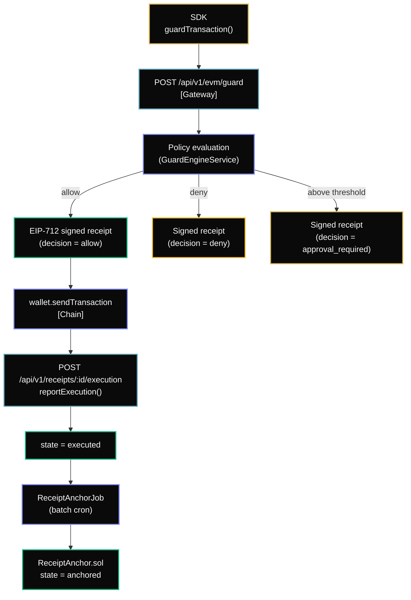

## Overview

AgentChain SDK v2 introduces the **EVM guard flow** — a pre-transaction policy check that returns a signed receipt before any value moves on-chain.



## Install

```bash
npm install @humbleaf/agentchain-sdk viem
```

## Create a client

```typescript
import { AgentChain } from '@humbleaf/agentchain-sdk';

const ac = new AgentChain({
  apiKey: process.env.AGENTCHAIN_API_KEY,
});
```

## Create a policy

Before guarding any transaction, create a policy for your chain and contract:

```typescript
await ac.policies.create({
  policyId: 'pol_uniswap_safe',
  chainId: 84532, // Base Sepolia
  label: 'Safe Uniswap swaps',
  rules: {
    allowedTargets: ['0x2626664c2603336E57B271c5C0b26F421741e481'],
    allowedSelectors: ['0x414bf389'], // exactInputSingle
    maxValueWei: '1000000000000000000',   // 1 ETH max
    maxSlippageBps: 100,                  // 1%
    dailyCapWei: '5000000000000000000',   // 5 ETH / day
    approvalThresholdWei: '500000000000000000', // > 0.5 ETH → approval
  },
});
```

## Guard and execute

```typescript
import { createWalletClient, http, encodeFunctionData } from 'viem';
import { privateKeyToAccount } from 'viem/accounts';
import { baseSepolia } from 'viem/chains';
import {
  AgentChainEvmPolicyDenied,
  AgentChainEvmApprovalRequired,
  AgentChainExpiredDecision,
} from '@humbleaf/agentchain-sdk';

const wallet = createWalletClient({
  account: privateKeyToAccount(process.env.PRIVATE_KEY as `0x${string}`),
  chain: baseSepolia,
  transport: http(),
});

try {
  const { receipt, transactionHash } = await ac.evm.guardAndExecute(wallet, {
    chainId: 84532,
    from: wallet.account.address,
    to: '0x2626664c2603336E57B271c5C0b26F421741e481',
    data: encodeFunctionData({ abi, functionName: 'exactInputSingle', args: [params] }),
    value: '0',
    policyId: 'pol_uniswap_safe',
  });

  console.log('✓ Transaction sent:', transactionHash);
  console.log('  Receipt:', receipt.receiptId, '| state:', receipt.state);
} catch (err) {
  if (err instanceof AgentChainEvmPolicyDenied) {
    console.error('✗ Denied:', err.reasonCodes);
  } else if (err instanceof AgentChainEvmApprovalRequired) {
    console.log('⏳ Needs approval. approvalId:', err.approvalId);
  } else if (err instanceof AgentChainExpiredDecision) {
    console.warn('⟳ Decision expired — retry guardAndExecute');
  } else {
    throw err;
  }
}
```

## Guard only (no execution)

If you want the policy decision without executing, use `guardTransaction`:

```typescript
const receipt = await ac.evm.guardTransaction({
  chainId: 84532,
  from: '0x...',
  to: '0x...',
  data: '0x...',
  value: '0',
  policyId: 'pol_uniswap_safe',
});

console.log(receipt.decision); // 'allow' | 'deny' | 'approval_required'
console.log(receipt.reasonCodes); // e.g. ['VALUE_EXCEEDED']
```

<Info>
**`decisionExpiresAt`** — The gateway sets this to `issuedAt + 300s`. If execution takes more than 5 minutes, call `guardTransaction` again for a fresh receipt. `guardAndExecute` throws `AgentChainExpiredDecision` automatically if the window has closed.
</Info>

## Verify a receipt locally

No network call required:

```typescript
const valid = ac.receipts.verify(
  receipt.receiptHash,
  receipt.signature,
  receipt.signerAddress,
);
console.log('signature valid:', valid);
```

## Verify on-chain (SignerAnchor)

For trustless verification — confirm the signer is authorized at the contract level:

```typescript
const ac = new AgentChain({
  apiKey: process.env.AGENTCHAIN_API_KEY,
  signerAnchorAddress: '0x36cbAE566545e8df3ad15C171a7840266526E28F', // Base Sepolia
  signerAnchorChainId: 84532,
  signerAnchorRpcUrl: 'https://sepolia.base.org',
});

const result = await ac.receipts.verifyWithAnchor(receipt);

if (result.valid && result.onChainVerified) {
  // Fully trustless: ECDSA passed + signer confirmed authorized on SignerAnchor
  console.log('Receipt is fully verified on-chain');
} else if (result.valid && !result.onChainVerified) {
  // ECDSA passed but on-chain check skipped or degraded
  console.log('ECDSA valid; on-chain check skipped:', result.reasons);
  // reasons: 'signer_anchor_unavailable' | 'signer_anchor_rpc_error'
} else {
  // Receipt is invalid
  console.log('Receipt invalid, reasons:', result.reasons);
  // reasons: 'signature_mismatch' | 'signer_revoked'
}
```

## Next steps

- [Policy model](/agentchain/policy-model) — configure rules, thresholds, and caps
- [Receipts](/agentchain/receipts) — receipt lifecycle, states, and verification
- [Deployments](/agentchain/deployments) — live anchor contract addresses
- [API reference](/api-reference) — REST endpoints
