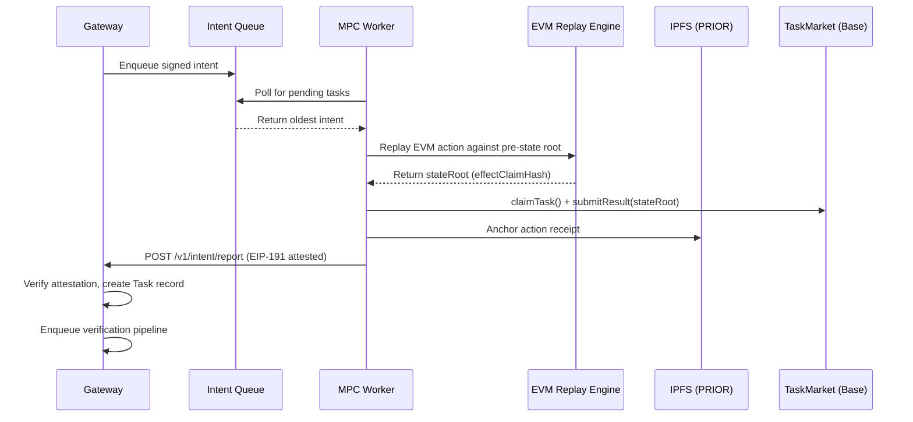

MPC Worker Nodes are the compute backbone of the AgentChain settlement layer. Each node polls the gateway for pending intents, executes deterministic EVM action replays, anchors a cryptographic action receipt to IPFS, and reports the result back with an EIP-191 attestation signature.

## Architecture



## Worker Lifecycle

Each MPC worker operates a continuous poll loop with four phases:

<Steps>
  <Step title="Poll">
    The worker calls `GET /v1/intent/tasks/pending` to fetch the oldest pending intent from the gateway's BullMQ queue.
    The endpoint requires admin-level authentication.
  </Step>
  <Step title="Replay">
    The worker fetches the intent payload from IPFS using the `payloadCid`. For `evm_action` tasks, the worker replays the declared transactions against the provided `preStateRootRaw` using the EVM replay engine. The output is a deterministic `stateRoot` — the hash of the post-execution state. For non-EVM tasks, the worker executes the action using the configured compute provider (Groq, Together, Ollama).
  </Step>
  <Step title="Anchor">
    The action receipt (including `stateRoot`, `onChainTaskId`, and shard metadata) is uploaded to IPFS via `POST /v1/prior/claim`, producing a content-addressed CID.
  </Step>
  <Step title="Report">
    The worker closes the loop by calling `POST /v1/intent/report` with the `payloadCid`, `onChainTaskId`, `stateRoot`, and an EIP-191 attestation signature. The gateway recovers the worker's address from the signature and creates a Task record in the database.
  </Step>
</Steps>

## EVM Action Replay

For deterministic EVM action verification, the worker:

1. **Reads** the `preStateRootRaw` and `transactions[]` from the intent payload
2. **Replays** each transaction against the state root using a local EVM simulation (Anvil fork or native replay)
3. **Computes** the `effectClaimHash` = `keccak256(chainId ++ postStateRoot ++ encodedEffects)`
4. **Compares** the computed hash against the claimed `effectClaimHash` from the intent
5. **Reports** `stateMatch: true/false` — the deterministic binary verdict

The `chainId` is included in the effect hash to prevent cross-chain replay attacks (IC-10).

<Info>
**Deterministic verification:** Because the EVM is a deterministic state machine, two independent workers replaying the same transactions against the same pre-state root will always produce the same `effectClaimHash`. This is what enables fast-path dispute resolution — no multi-round bisection needed.
</Info>

## EIP-191 Attestation

Every report includes an ECDSA signature that cryptographically binds the worker's identity to the computation result. No shared secrets — pure public key identity.

**Signing algorithm:**

1. Concatenate strings: `preimage = payloadCid + onChainTaskId + stateRoot`
2. Hash: `attestationHash = keccak256(preimage)`
3. EIP-191 envelope: `digest = keccak256("\x19Ethereum Signed Message:\n32" + attestationHash)`
4. Sign: `signature = secp256k1_sign(workerPrivateKey, digest)`

The gateway recovers the signer address and verifies it matches the claimed `workerAddress`. Reports without valid attestations are rejected in production.

## Configuration

| Variable | Required | Description |
|----------|----------|-------------|
| `ADMIN_TOKEN` | Yes | Bearer token for gateway admin endpoints |
| `WORKER_PRIVATE_KEY` | Production | secp256k1 private key (hex, with or without `0x` prefix) |
| `MPC_NODE_ID` | No | Human-readable node identifier (default: `mpc-node-alpha`) |
| `GHOST_CHAIN_RPC` | No | RPC URL for local Anvil instance used in EVM replay (default: `http://localhost:8545`) |

<Warning>
  The `WORKER_PRIVATE_KEY` controls the worker's on-chain identity. In production, use hardware security modules (HSM) or cloud KMS instead of raw environment variables.
</Warning>

## API Endpoints

The MPC worker consumes two gateway endpoints:

<CardGroup cols={2}>
  <Card title="Fetch Pending Tasks" icon="inbox" href="/api-reference/intent/fetch-oldest-pending-tasks-for-mpc-worker">
    `GET /v1/intent/tasks/pending` — Pop the oldest intent from the queue.
  </Card>
  <Card title="Upload to PRIOR" icon="cloud-arrow-up" href="/api-reference/prior/upload-context-payload-or-json-to-prior-ipfs">
    `POST /v1/prior/claim` — Anchor action receipts to IPFS.
  </Card>
</CardGroup>

## Running a Node

```bash
# Clone and build
cd apps/mpc-worker
cargo build --release

# Run with signing key
ADMIN_TOKEN=your-admin-token \
WORKER_PRIVATE_KEY=0xac0974bec39a17e36ba4a6b4d238ff944bacb478cbed5efcae784d7bf4f2ff80 \
MPC_NODE_ID=mpc-node-01 \
cargo run --release
```

## On-Chain Settlement

After action replay and verification, the worker interacts with `TaskMarket.sol` on Base to settle the task on-chain:

1. **`claimTask()`** — Locks the worker's USDC collateral bond
2. **`submitResult(stateRoot)`** — Submits the deterministic `effectClaimHash` on-chain
3. **`resolveTask()`** — After the challenge window expires, the worker receives their bounty minus the protocol fee

If a dispute is raised during the challenge window, the task enters the `BisectionCourtV3` for deterministic fast-path resolution. For EVM actions, the court resolves the dispute in a single step (~10 seconds) rather than using the traditional multi-round bisection game.

<Info>
**Protocol fee schedule:** Fees are tiered based on the action value — from 25% for micro-actions (<$100) down to 0.25% for whale-tier actions (>$100K). See [Credits & Billing](/agent-operators/credits-billing) for the full schedule.
</Info>
