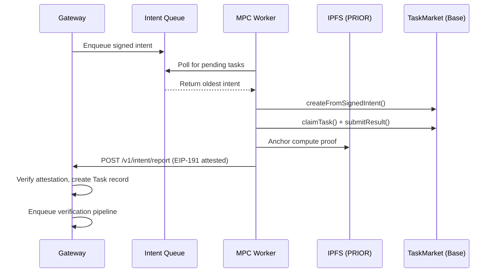

MPC Worker Nodes are the compute backbone of the AgentChain settlement layer. Each node polls the gateway for pending intents, executes the computation, anchors a cryptographic proof to IPFS, and reports the result back with an EIP-191 attestation signature.

## Architecture



## Worker Lifecycle

Each MPC worker operates a continuous poll loop with four phases:

<Steps>
  <Step title="Poll">
    The worker calls `GET /v1/intent/tasks/pending` to fetch the oldest pending intent from the gateway's BullMQ queue.
    The endpoint requires admin-level authentication.
  </Step>
  <Step title="Compute">
    The worker fetches the intent payload from IPFS using the `payloadCid`, executes the EVM action replay, and produces a deterministic `stateRoot` hash of the output.
  </Step>
  <Step title="Anchor">
    The compute proof (including `stateRoot`, `onChainTaskId`, and shard metadata) is uploaded to IPFS via `POST /v1/prior/claim`, producing a content-addressed CID.
  </Step>
  <Step title="Report">
    The worker closes the loop by calling `POST /v1/intent/report` with the `payloadCid`, `onChainTaskId`, `stateRoot`, and an EIP-191 attestation signature. The gateway recovers the worker's address from the signature and creates a Task record in the database.
  </Step>
</Steps>

## EIP-191 Attestation

Every report includes an ECDSA signature that cryptographically binds the worker's identity to the computation result. No shared secrets — pure public key identity.

**Signing algorithm:**

1. Concatenate strings: `preimage = payloadCid + onChainTaskId + stateRoot`
2. Hash: `attestationHash = keccak256(preimage)`
3. EIP-191 envelope: `digest = keccak256("\x19Ethereum Signed Message:\n32" + attestationHash)`
4. Sign: `signature = secp256k1_sign(workerPrivateKey, digest)`

The gateway recovers the signer address and verifies it matches the claimed `workerAddress`. Reports without valid attestations are rejected in production.

## Configuration

| Variable | Required | Description |
|----------|----------|-------------|
| `ADMIN_TOKEN` | Yes | Bearer token for gateway admin endpoints |
| `WORKER_PRIVATE_KEY` | Production | secp256k1 private key (hex, with or without `0x` prefix) |
| `MPC_NODE_ID` | No | Human-readable node identifier (default: `mpc-node-alpha`) |

<Warning>
  The `WORKER_PRIVATE_KEY` controls the worker's on-chain identity. In production, use hardware security modules (HSM) or cloud KMS instead of raw environment variables.
</Warning>

## API Endpoints

The MPC worker consumes two gateway endpoints:

<CardGroup cols={2}>
  <Card title="Fetch Pending Tasks" icon="inbox" href="/api-reference/intent/fetch-oldest-pending-tasks-for-mpc-worker">
    `GET /v1/intent/tasks/pending` — Pop the oldest intent from the queue.
  </Card>
  <Card title="Upload to PRIOR" icon="cloud-arrow-up" href="/api-reference/prior/upload-context-payload-or-json-to-prior-ipfs">
    `POST /v1/prior/claim` — Anchor compute proofs to IPFS.
  </Card>
</CardGroup>

## Running a Node

```bash
# Clone and build
cd apps/mpc-worker
cargo build --release

# Run with signing key
ADMIN_TOKEN=your-admin-token \
WORKER_PRIVATE_KEY=0xac0974bec39a17e36ba4a6b4d238ff944bacb478cbed5efcae784d7bf4f2ff80 \
MPC_NODE_ID=mpc-node-01 \
cargo run --release
```

## On-Chain Settlement

After computation, the worker interacts with `TaskMarket.sol` on Base:

1. **`createFromSignedIntent()`** — Creates a task on-chain from the gateway's EIP-712 signed intent
2. **`claimTask()`** — Locks the worker's USDC collateral bond
3. **`submitResult()`** — Submits the deterministic `stateRoot` on-chain
4. **`resolveTask()`** — After the challenge window expires, the worker receives their bounty minus the protocol fee

If a dispute is raised during the challenge window, the task enters the BisectionCourt for interactive verification.
