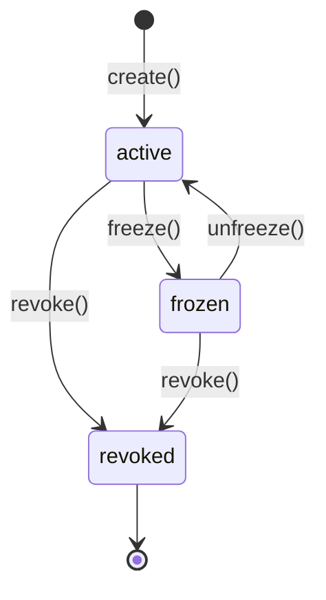

## What is a policy?

A policy is a gateway-canonical set of rules that the guard engine evaluates against an incoming transaction intent. It binds to a specific **`policyId`** and **`chainId`** — no single policy spans multiple chains.

Every mutation of the rules set creates a new **immutable snapshot** (incremented `version`). The `policyHash` is a deterministic `keccak256(JCS(body))` fingerprint of the policy body at that version.

## Policy shape

```typescript
type GuardPolicyRulesV2 = {
  allowedTargets: string[];           // contract addresses (lowercased)
  allowedSelectors: string[];         // 4-byte function selectors
  maxValueWei: string;                // max ETH value per tx (decimal string)
  maxSlippageBps: number;             // max slippage (basis points)
  dailyCapWei: string;                // rolling 24h aggregate cap
  approvalThresholdWei: string;       // value above which → approval_required
};

type GuardPolicyState = 'active' | 'frozen' | 'revoked';
```

All string values are decimal-encoded (not hex) for JSON interoperability. `allowedTargets` are stored and compared lowercased.

## Policy hash

The `policyHash` is computed by:

1. Strip ephemeral fields (`owner`, `createdAt`, `updatedAt`, `metadata`)
2. Lowercase all entries in `allowedTargets`
3. Serialize with **JCS (RFC 8785)** — canonical JSON
4. Hash with `keccak256(utf8(jcs_string))`

You can compute it locally (for offline verification) or server-side:

```typescript
// Local (no network) — @agentchain/core
const { policyHash, canonical } = ac.policies.hash(policyBody);

// Remote (gateway confirmation)
const { policyHash } = await ac.policies.hashRemote(policyBody);
```

Both must return the same hash. A mismatch indicates a bug.

## Guard rules engine

| Rule | Check | Deny reason code |
|------|-------|-----------------|
| Target allowlist | `tx.to ∈ allowedTargets` | `PROTOCOL_NOT_ALLOWED` |
| Selector allowlist | `tx.data[0:4] ∈ allowedSelectors` | `SELECTOR_NOT_ALLOWED` |
| Max value | `tx.value ≤ maxValueWei` | `VALUE_EXCEEDED` |
| Slippage | **Not enforced in v0.2** — stored and hashed but not evaluated | *(deferred)* |
| Daily cap | rolling 24h aggregate ≤ `dailyCapWei` (see note below) | `DAILY_CAP_EXCEEDED` |
| Simulation | `eth_call` succeeds (when `simulate: true`) | `SIMULATION_REVERT` |
| Approval threshold | `tx.value > approvalThresholdWei` | → `approval_required` (not denied) |

Evaluation order: target → selector → value → daily cap → simulation → threshold.

> **`maxSlippageBps` is not enforced in v0.2.** The field is stored in the policy body and
> included in the `policyHash`, but the guard engine does not evaluate it. Pilots setting
> `maxSlippageBps` should treat it as a label for future enforcement (planned v0.3).
> Transactions will not be denied based on slippage in the current release.

> **`dailyCapWei` uses a rolling 24-hour window, not a calendar day.**
> The cap counts executed + anchored transactions in the last 86,400 seconds from the current
> timestamp — not from midnight UTC. Compliance teams expecting a midnight reset should note this
> distinction. Calendar-day reset is planned as an opt-in flag in v0.3.

> **`from` address is not constrained in v0.2.**
> Any address can submit a guard request for your policy. The policy rules constrain what the
> transaction can **do** (target, selector, value) — not which agent can **request** the guard.
> Per-caller allowlists (`allowedCallers`) are a v0.3 roadmap item.

## CRUD

```typescript
// Create
const policy = await ac.policies.create({
  policyId: 'pol_swap_safe',
  chainId: 84532,
  rules: { ... },
});

// Read
const current = await ac.policies.get('pol_swap_safe', 84532);

// Update (creates new snapshot version)
const updated = await ac.policies.update('pol_swap_safe', 84532, {
  rules: { ...current.rules, maxValueWei: '2000000000000000000' },
});

// Version history
const history = await ac.policies.listVersions('pol_swap_safe', 84532);
```

## Policy State Machine

Every policy has a `state` field that follows a strict one-way progression:



| State | Guard requests | Existing receipts | Reversible? |
|-------|---------------|-------------------|-------------|
| `active` | ✅ Accepted | ✅ Valid | — |
| `frozen` | ❌ Rejected (`POLICY_FROZEN`) | ✅ Valid | Yes — `unfreeze()` |
| `revoked` | ❌ Rejected (`POLICY_REVOKED`) | ❌ Invalidated | No — permanent |

<Warning>
**`revoked` is irreversible.** Once a policy is revoked, no new guard requests are accepted and `verifyRemote()` returns `valid: false` for all receipts issued under it. Use `frozen` for temporary suspension.
</Warning>

```typescript
// Freeze (pausable)
await ac.policies.freeze('pol_swap_safe', 84532);
await ac.policies.unfreeze('pol_swap_safe', 84532);

// Revoke (permanent)
await ac.policies.revoke('pol_swap_safe', 84532);
```

---

## policySource field in receipts

| Value | Meaning |
|-------|---------|
| `"gateway"` | Policy resolved from the gateway database (default) |
| `"anchored"` | Policy hash is anchored on-chain via `PolicyAnchor` (`0xe69BCa52D31Ea05034252b5A4034F045A401DDAC`) |
| `"onchain_registry"` | Policy resolved from `AgentPolicy.sol` (future) |

## Chain binding

A policy binds to exactly one `chainId`. If a guard request arrives with a different `chainId` than the policy's, the gateway returns **HTTP 400 `CHAIN_MISMATCH`**.

---

## Internal — ops_action policy domain (`ops-default`)

<Note>
This section documents the **ops_action** policy kind — repo/workflow evaluate-only guard rules stored in the same `GuardPolicy` / `GuardPolicySnapshot` tables as EVM guard policies. It is **internal dogfood** (not yet in public SDK examples). Rust witness for ops_action remains deferred.
</Note>

### Domain binding

| Field | Value |
|-------|-------|
| `policyId` | `ops-default` |
| `chainId` | `0` (synthetic non-EVM domain — not an EVM chain) |
| `policyKind` (in rules) | `"ops_action"` |
| `policySource` | `"gateway"` (no on-chain anchor for `chainId: 0`) |

Ops policies use the **same** `PolicySnapshotBody` wrapper and **same** `hashPolicyBody` / JCS + keccak256 pipeline as EVM guard policies. The rules body is **not** `GuardPolicyRulesV2` — it carries branch, path, and workflow rules instead.

### Policy body shape

```typescript
type PolicySnapshotBody = {
  policyId: 'ops-default';
  version: number;
  chainId: 0;
  rules: OpsActionPolicyRulesV0;
};

type OpsActionPolicyRulesV0 = {
  policyKind: 'ops_action';
  snapshotVersion: 'ops-policy-snapshot-v0.1.0';
  actionKinds: ('repo.branch_push' | 'repo.workflow_dispatch')[];
  branchRules: { allowedTargetBranchPrefixes: string[]; protectedBranches: string[]; blockedBranchPrefixes: string[] };
  pathRules: { denyPatterns: string[]; reviewPatterns: string[]; /* ... */ };
  workflowRules: { allowlistedWorkflows: string[]; reviewWorkflowPatterns: string[]; denyUnknownWorkflows: boolean; /* ... */ };
  routeRules: { allowRoute: string; reviewRoute: string; denyRoute: string; workflowFastPathRoute: string };
  invariants: { noExecutionV0: true; nestOnlyWitness: true; syntheticReceipt: true };
  reasonCodeVersion: string;
  routeMatrixVersion: string;
};
```

Canonical example: `docs/contracts/trust-router/examples/ops-policy-snapshot-body-v0.1.json`

### Create / seed (internal)

```bash
# Idempotent — creates ops-default v1 if missing
OPERATOR_ID=<operator-cuid> DATABASE_URL=<postgres-url> pnpm ops-action:policy:seed
```

Via gateway API (requires authenticated operator):

```typescript
await ac.policies.create({
  policyId: 'ops-default',
  chainId: 0,
  label: 'Default ops_action policy',
  rules: {
    policyKind: 'ops_action',
    snapshotVersion: 'ops-policy-snapshot-v0.1.0',
    // ... branchRules, pathRules, workflowRules, routeRules, invariants
  },
});
```

`chainId: 0` is **only** valid when `rules.policyKind === 'ops_action'`. EVM guard policies still require `1`, `8453`, or `84532`.

### Evaluation flow

```
ops action request
  → load GuardPolicySnapshot (ops-default, chainId 0)
  → evaluateOpsActionV0(action, snapshot.body.rules)
  → evidence row: policySnapshotId (DB cuid), policyHash, opsMatchedRules
```

The ops evaluator does **not** execute git push, workflow dispatch, or GitHub API calls — evaluate-only with synthetic ops receipts.

### Hash parity

Ops policy hashes are computable via the same tools as EVM:

```typescript
const body = { policyId: 'ops-default', version: 1, chainId: 0, rules: { policyKind: 'ops_action', /* ... */ } };
const { policyHash } = ac.policies.hash(body);       // local
const remote = await ac.policies.hashRemote(body);   // POST /api/v1/policies/hash
```

---

## PolicyAnchor — Security Notes

The `PolicyAnchor` contract is **permissionless**: any address can anchor any `policyId` string for any
operator address. The first caller wins the `policyKey = keccak256(operatorAddress, policyId, chainId)`.

> **Front-running mitigation**: The AgentChain gateway anchors your policy key immediately on creation
> (best-effort, async). If the anchor call is delayed, a third party could theoretically claim your
> `policyKey` before the gateway does. This is a testnet-only risk — the gateway has SLA anchoring
> within 30 seconds of policy creation. For mainnet, EIP-712 signed anchor claims are planned (v0.3).

Anchoring does NOT affect guard enforcement — the gateway uses its database as the source of truth.
`PolicyAnchor` is an **audit log**, not a policy registry.
