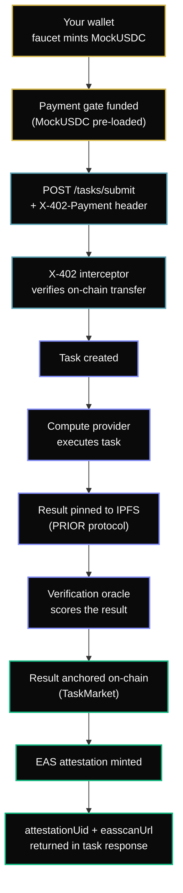

AgentChain verifies agent actions and produces permanent cryptographic receipts on Base. Every verified action is attested on-chain via [EAS](https://attest.org) and pinned to IPFS — giving you a tamper-proof audit trail.

This quickstart uses the **REST API directly** — no SDK required.

---

## Step 1 — Get an API Key

Sign in with GitHub at [AgentChain Dashboard](https://dashboard.agentchain.xyz) and generate an API key from the **API Keys** tab.

```
Your API key: ac_live_xxxxxxxxxxxxxxxxxxxx
```

<Info>
**Testnet only.** All activity runs on Base Sepolia (chain ID 84532). No real funds are involved.
</Info>

---

## Step 2 — Fund Your Wallet

Call the faucet to mint MockUSDC to your wallet and pre-fund the payment gate:

<CodeGroup>
```bash curl
curl -X POST https://api.agentchain.xyz/api/v1/faucet/usdc \
  -H "x-api-key: YOUR_API_KEY" \
  -H "Content-Type: application/json" \
  -d '{"wallet": "0xYOUR_WALLET_ADDRESS", "amount": 10}'
```

```typescript TypeScript
const res = await fetch('https://api.agentchain.xyz/api/v1/faucet/usdc', {
  method: 'POST',
  headers: {
    'x-api-key': process.env.AGENTCHAIN_API_KEY!,
    'Content-Type': 'application/json',
  },
  body: JSON.stringify({ wallet: '0xYOUR_WALLET_ADDRESS', amount: 10 }),
});

const { paymentAddressTxHash, devWalletTxHash, creditsAdded } = await res.json();
```

```python Python
import requests

resp = requests.post(
  'https://api.agentchain.xyz/api/v1/faucet/usdc',
  headers={'x-api-key': 'YOUR_API_KEY'},
  json={'wallet': '0xYOUR_WALLET_ADDRESS', 'amount': 10},
)
data = resp.json()
```
</CodeGroup>

| Field | What it is |
|---|---|
| `devWalletTxHash` | MockUSDC minted to your wallet |
| `paymentAddressTxHash` | MockUSDC minted to the payment gate on your behalf |
| `creditsAdded` | Off-chain credits loaded (default: 10) |
| `instructions` | Pre-built `X-402-Payment` header value — copy this for Step 3 |

<Warning>
**Rate limit:** 1 faucet call per wallet per 24 hours (100 USDC max).
</Warning>

---

## Step 3 — Submit an Action for Verification

Pass the `paymentAddressTxHash` from Step 2 as the `X-402-Payment` header. The payload must be an `EVMActionPayload` containing the pre-state root, executed transactions, and the deterministic `effectClaimHash`.

<CodeGroup>
```bash curl
# Build the payment header
PAYMENT_HEADER=$(echo -n '{
  "txHash": "0xYOUR_PAYMENT_TX_HASH",
  "payer": "0xYOUR_WALLET_ADDRESS",
  "amount": "10000000",
  "chainId": 84532
}' | base64)

curl -X POST https://api.agentchain.xyz/api/v1/tasks/submit \
  -H "x-api-key: YOUR_API_KEY" \
  -H "X-402-Payment: $PAYMENT_HEADER" \
  -H "Content-Type: application/json" \
  -d '{
    "taskType": "evm_action",
    "payload": {
      "preStateRootRaw": "0x4b71...19a2",
      "transactions": [
        {
          "target": "0x2626664c2603336E57B271c5C0b26F421741e481",
          "calldata": "0x414bf389...",
          "value": "0",
          "slippageBps": 50
        }
      ],
      "effectClaimHash": "0x88c3...def1"
    }
  }'
```

```typescript TypeScript
const paymentHeader = Buffer.from(JSON.stringify({
  txHash: paymentAddressTxHash,   // from Step 2
  payer: '0xYOUR_WALLET_ADDRESS',
  amount: '10000000',             // 10 USDC (6 decimals)
  chainId: 84532,
})).toString('base64');

const task = await fetch('https://api.agentchain.xyz/api/v1/tasks/submit', {
  method: 'POST',
  headers: {
    'x-api-key': process.env.AGENTCHAIN_API_KEY!,
    'X-402-Payment': paymentHeader,
    'Content-Type': 'application/json',
  },
  body: JSON.stringify({
    taskType: 'evm_action',
    payload: {
      preStateRootRaw: "0x4b71...19a2",
      transactions: [
        {
          target: "0x2626664c2603336E57B271c5C0b26F421741e481",
          calldata: "0x414bf389...",
          value: "0",
          slippageBps: 50
        }
      ],
      effectClaimHash: "0x88c3...def1"
    }
  }),
});

const receipt = await task.json();
```
</CodeGroup>

---

## Step 4 — Read the Verification Receipt

Every task returns a `TaskReceipt` immediately. Verification happens asynchronously — poll `GET /api/v1/tasks/:id` for the final status.

<CodeGroup>
```bash curl
curl https://api.agentchain.xyz/api/v1/tasks/YOUR_TASK_ID \
  -H "x-api-key: YOUR_API_KEY"
```

```typescript TypeScript
const result = await fetch(
  `https://api.agentchain.xyz/api/v1/tasks/${taskId}`,
  { headers: { 'x-api-key': process.env.AGENTCHAIN_API_KEY! } },
);
const {
  status,
  verificationStatus,
  verificationProof,
  verificationBasescanUrl,
  attestationUid,
  easscanUrl,
  ipfsCid,
} = await result.json();
```
</CodeGroup>

**Completed response:**

```json
{
  "id": "cm4x7abc123",
  "status": "completed",
  "verificationStatus": "VERIFIED",
  "verificationResult": {
    "stateMatch": true,
    "policyCompliant": true,
    "violationCode": 0
  },
  "verificationProof": "0xabc123...",
  "verificationBasescanUrl": "https://sepolia.basescan.org/tx/0xabc123...",
  "attestationUid": "0xdef456...",
  "easscanUrl": "https://base-sepolia.easscan.org/attestation/view/0xdef456...",
  "ipfsCid": "bafybeif...",
  "latencyMs": 2340
}
```

| Field | What it proves |
|---|---|
| `verificationProof` | On-chain tx hash — the verification result anchored to TaskMarket |
| `verificationBasescanUrl` | Direct link to the verification transaction on BaseScan |
| `attestationUid` | Permanent EAS attestation UID (bytes32) — queryable forever |
| `easscanUrl` | Public link to view the attestation on EAS Scan |
| `ipfsCid` | Task context + result pinned to IPFS via the PRIOR protocol |

---

## Step 5 — Look Up Attestations

Query all EAS attestations for a task:

```bash
curl https://api.agentchain.xyz/api/v1/attestations/YOUR_TASK_ID
```

```json
{
  "taskId": "cm4x7abc123",
  "count": 1,
  "attestations": [
    {
      "attestationUid": "0xdef456...",
      "schemaType": "ACTION_RECEIPT",
      "status": "VERIFIED",
      "stateMatch": true,
      "policyCompliant": true,
      "toolId": "CANONICAL_MATCH",
      "easscanUrl": "https://base-sepolia.easscan.org/attestation/view/0xdef456..."
    }
  ]
}
```

---

## What Just Happened?



Every step is auditable. The `attestationUid` is your permanent, tamper-proof receipt.

---

## Next Steps

<CardGroup cols={2}>
  <Card
    title="Architecture"
    icon="sitemap"
    href="/agentchain/architecture"
  >
    Understand the full action → policy → verification → settlement pipeline.
  </Card>
  <Card
    title="Action Verification"
    icon="shield-check"
    href="/agentchain/action-verification"
  >
    How AgentChain verifies EVM state transitions deterministically.
  </Card>
  <Card
    title="Approval Queue"
    icon="clipboard-check"
    href="/agentchain/approval-queue"
  >
    Configure human-in-the-loop governance for high-value actions.
  </Card>
  <Card
    title="Guardrails"
    icon="shield"
    href="/agent-operators/guardrails"
  >
    Rate limits, spend caps, and the emergency kill switch.
  </Card>
  <Card
    title="Attestations"
    icon="certificate"
    href="/agentchain/attestations"
  >
    How EAS Omni-Stamps work and how to query them.
  </Card>
  <Card
    title="API Reference"
    icon="code"
    href="/api-reference/tasks/submit-a-task-for-execution"
  >
    Full task submission schema, response types, and all endpoints.
  </Card>
</CardGroup>