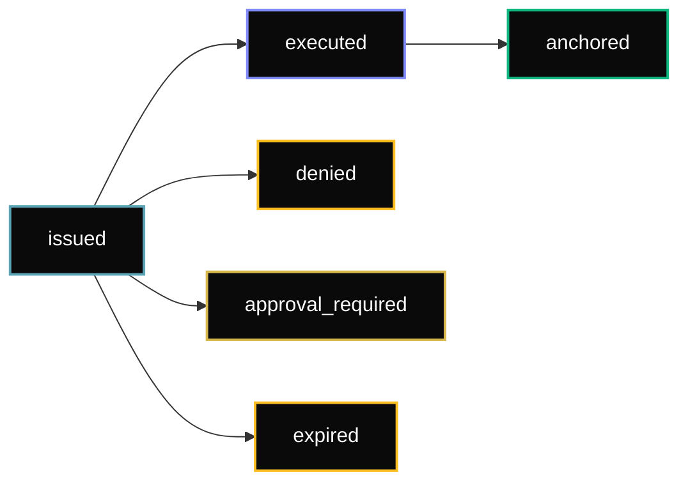

## What is a receipt?

A receipt is a **cryptographically signed, gateway-issued document** that records the outcome of a policy guard request. It is the trust artifact of the AgentChain system — independently verifiable without a network call.

## Receipt lifecycle



| State | Terminal? | Meaning |
|-------|-----------|---------|
| `issued` | No | Guard evaluated, decision signed, awaiting client execution |
| `executed` | No | Client reported `txHash` via `reportExecution()` |
| `anchored` | Yes | `receiptHash` written on-chain to `ReceiptAnchor` |
| `denied` | Yes | Policy rejected — no execution possible |
| `approval_required` | No | Held in approval queue pending operator decision |
| `expired` | Yes | `decisionExpiresAt` passed before execution was reported |

## Receipt fields

```typescript
type EvmGuardReceiptV2 = {
  receiptId: string;           // UUID
  state: 'issued' | 'executed' | 'denied' | 'approval_required' | 'expired' | 'anchored';
  decision: 'allow' | 'deny' | 'approval_required';

  // Policy binding
  policyId: string;
  chainId: number;
  policyHash: string;          // keccak256(JCS(policy body at version))
  policyVersion: number;
  policySource: 'gateway' | 'anchored' | 'onchain_registry';

  // Transaction intent (what was guarded)
  from: string;
  to: string;
  data: string;
  value: string;
  calldataHash: string;        // keccak256(data)
  simulationHash: string;      // keccak256(blockNum + returnData) — ZERO_B32 in MVP

  // Timing
  issuedAt: string;            // ISO 8601
  decisionExpiresAt: string;   // ISO 8601 — MUST send before this (default: issuedAt + 300s)
  receiptExpiresAt: string;    // ISO 8601 (0 = never)

  // Signature (EIP-712)
  receiptHash: string;         // EIP-712 typed data digest
  signature: string;           // 65-byte ECDSA (hex)
  signerAddress: string;       // recovering address
  signerKeyId: string;         // key rotation handle

  // Deny / approval
  reasonCodes: string[];       // e.g. ['VALUE_EXCEEDED']
  approvalId: string | null;   // present when decision = approval_required

  // Execution (filled after reportExecution)
  executionTxHash: string | null;
  executionChainId: number | null;
  executionReportedAt: string | null;

  // Anchor (filled after on-chain anchoring)
  anchorTxHash: string | null; // tx that wrote receiptHash to ReceiptAnchor
};
```

## Signature scheme

Receipts are signed with **EIP-712** (`keccak256(0x1901 ‖ domainSeparator ‖ structHash)`).

```typescript
const ReceiptDomain = {
  name: "AgentChain Receipt",
  version: "2",
  chainId: <number>,                        // chain the receipt authorizes
  verifyingContract: "0x36cbAE566545e8df3ad15C171a7840266526E28F", // SignerAnchor (Base Sepolia)
};
```

The `chainId` in the domain separator **binds the signature to a specific chain**. A receipt signed for Base Sepolia (84532) cannot be replayed on Base mainnet (8453) — the domain hash will differ.

## Local verification (no network)

```typescript
import { AgentChain } from '@humbleaf/agentchain-sdk';

const ac = new AgentChain({ apiKey: '...' });
const valid = ac.receipts.verify(
  receipt.receiptHash as `0x${string}`,
  receipt.signature as `0x${string}`,
  receipt.signerAddress as `0x${string}`,
);
```

Uses `@agentchain/core` `verifyReceiptSignature` — pure ECDSA recover, no HTTP.

## On-chain verification (trustless)

```typescript
const ac = new AgentChain({
  apiKey: '...',
  signerAnchorAddress: '0x36cbAE566545e8df3ad15C171a7840266526E28F',
  signerAnchorChainId: 84532,
  signerAnchorRpcUrl: 'https://sepolia.base.org',
});

const result = await ac.receipts.verifyWithAnchor(receipt);
```

`verifyWithAnchor` performs two independent checks:
1. **ECDSA verify** — `signerAddress` correctly recovers from `receiptHash` + `signature`
2. **On-chain check** — `SignerAnchor.isAuthorized(signerAddress)` returns `true`

```typescript
// VerifyReceiptResult discriminated union
type VerifyReceiptResult =
  | { valid: true;  anchorState: 'authorized'; reasons: [] }
  | { valid: true;  anchorState: 'unavailable'; reasons: ['signer_anchor_unavailable'] }
  | { valid: false; anchorState: 'revoked';    reasons: ['signer_revoked'] }
  | { valid: false; anchorState: 'mismatch';   reasons: ['signature_invalid'] };
```

The SDK degrades gracefully (IC-30): if the RPC call fails, `anchorState` is `'unavailable'` and ECDSA verification alone is used. Never a silent pass.

## Remote verification

```typescript
const result = await ac.receipts.verifyRemote(receipt);
if (!result.valid) {
  console.error('Invalid:', result.reasons);
}
```

The gateway checks signature, expiry, state, and `SignerAnchor` revocation status.

## Fetch by ID

```typescript
const stored = await ac.receipts.get(receiptId);
```

## Report execution

After `guardTransaction` returns `allow`, call this after you send the transaction:

```typescript
const updated = await ac.evm.reportExecution(receipt.receiptId, txHash);
// updated.state === 'executed'
```

`guardAndExecute` calls this automatically.

## `decisionExpiresAt`

The gateway sets `decisionExpiresAt` to `issuedAt + 300s` (configurable). If your execution logic takes more than 5 minutes, call `guardTransaction` again for a fresh receipt.

The SDK throws `AgentChainExpiredDecision` if `decisionExpiresAt < now` when `guardAndExecute` tries to send.

## Anchoring

When a policy has `anchoring = "receipt_hash_onchain"`, the gateway's `ReceiptAnchorJob` batch-writes the `receiptHash` to `ReceiptAnchor.sol` on the declared chain. The receipt transitions from `executed` → `anchored` after 2 confirmations.

**`ReceiptAnchor` on Base Sepolia:** `0x1F98D953785047f25a4886D12D103F4D67F1D8B3`

```typescript
// Poll anchor status
const status = await ac.receipts.getAnchorStatus(receiptId);
// status.state — 'pending' | 'anchored'
// status.anchorTxHash — string | null
```
